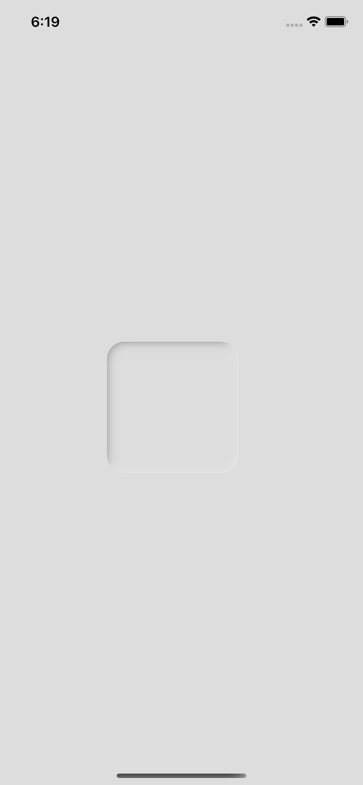
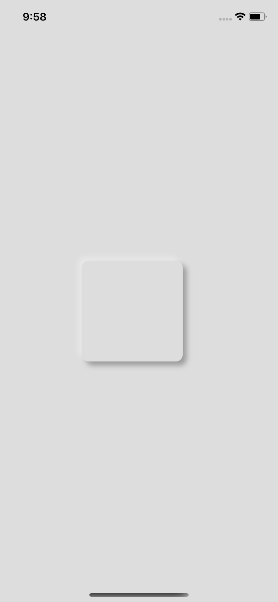
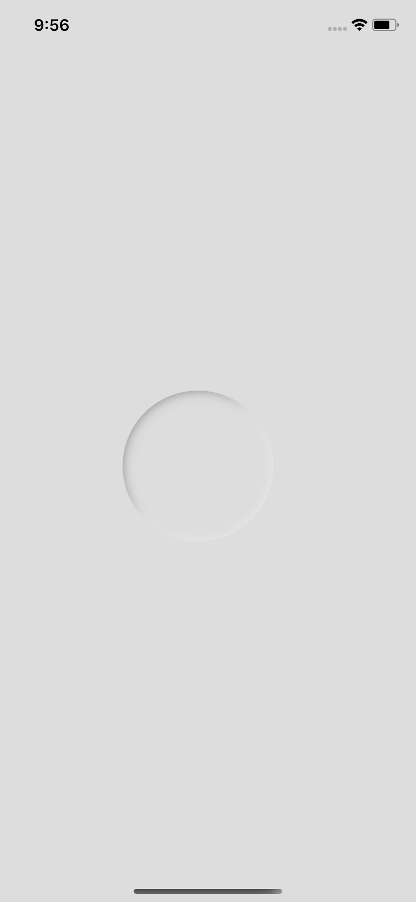
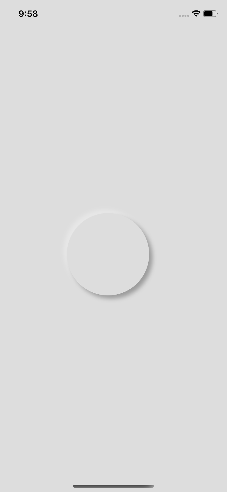

# Neumorph React Native

## Installation

### Step 1
Install <a href="https://docs.swmansion.com/react-native-reanimated/docs/installation" target="_blank">react-native-reanimated v2</a>

### Step 2

```bash 
cd ios && pod install && cd ..
```

## Usage

### Neumorph
Static Neumorph component
```jsx
import { Neumorph } from 'library-name';

...

<Neumorph
  inner // <- enable inner shadow
  basin // <- support only android
  darkShadowColor="#000000"
  lightShadowColor="#ffffff"
  style={{
      backgroundColor: '#dddddd',
      shadowOpacity: 0.3,
      shadowRadius: 4,
      borderRadius: 100,
      marginTop: 20,
      marginRight: 20,
      width: 150,
      height: 150,
  }}
>
  ...
</Neumorph>
```

### AnimatedNeumorph
Animated Neumorph component
```jsx
import { AnimatedNeumorph } from 'library-name';
import { useSharedValue, useAnimatedStyle, Easing, withTiming, useValue } from 'react-native-reanimated';

...

const width = useSharedValue(150);

...

const startAnimation = () => {
  width.value = withTiming(300, {
      duration: 300,
      easing: Easing.ease
  });
}

...

const animaStyle = useAnimatedStyle(() => {
  return {
    width: withTiming(width.value, {
        duration: 1500,
        easing: Easing.bezier(0.25, 0.1, 0.25, 1)
    })
  }
})

...

<AnimatedNeumorph
  inner
  style={[
    styleAnim1,
    { 
      backgroundColor: '#dddddd',
      shadowOpacity: 1,
      shadowRadius: 4,
      borderRadius: 50,
      marginTop: 20,
      height: 150,
      marginRight: 20
  }]}
/>
```

## Neumorph/AnimatedNeumorph property
Name | Type | Default | Description
:--- | :--- | :--- | :---
inner | boolean | false | 	If **true**, a shadow will be inside of component
style | object | undefined | Like View/Layout style prop, **width** & **height** is required. 
basin | boolean | false | Specifies the appearance of a basin shape(Android only)
darkShadowColor | string | #000000 | Specifies the color of the dark shadow
lightShadowColor | string | #ffffff | Specifies the color of the light shadow
children | node | undefined | 
swapShadow | boolean | false | Swaps light and dark shadows in places

## Example
<span style="display:block;text-align:center;">
  
  
</span>
<span style="display:block;text-align:center;">
  
  
</span>

## Supported

Patform | Versiom
:--- | :----
iOS | iOS 13.0
Android | SDK version 21