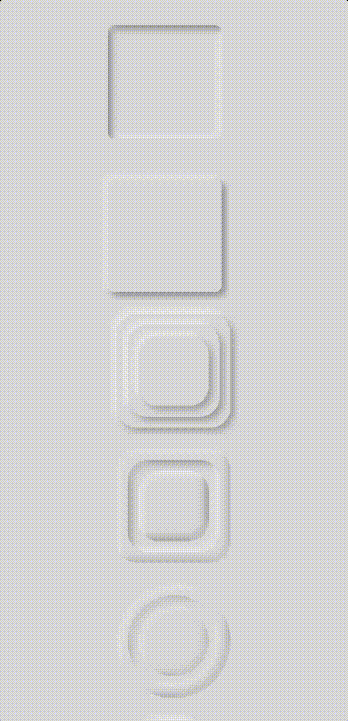

# Neumorph React Native

## Installation

### Step 1
```bash
npm install react-native-neumorph
```
or
```bash
yarn add react-native-neumorph
```

### Step 2

```bash 
cd ios && pod install && cd ..
```

## Usage

### Neumorph
Static Neumorph component (supported React Native Animation, React Native Reanimated v1, React Native Reanimated v2)
```jsx
import { Neumorph } from 'react-native-neumorph';

...

<Neumorph
  inner // <- enable inner shadow
  basin // <- support only android
  darkShadowColor="#000000"
  lightShadowColor="#ffffff"
  style={{
      backgroundColor: '#dddddd',
      shadowOpacity: 0.3,
      shadowRadius: 4,
      borderRadius: 100,
      marginTop: 20,
      marginRight: 20,
      width: 150,
      height: 150,
  }}
>
  ...
</Neumorph>
```

## Neumorph property
Name | Type | Default | Description
:--- | :--- | :--- | :---
inner | boolean | false | 	If **true**, a shadow will be inside of component
style | object | undefined | Like View/Layout style prop, **width** & **height** is required. 
basin | boolean | false | Specifies the appearance of a basin shape(Android only)
darkShadowColor | string | #000000 | Specifies the color of the dark shadow
lightShadowColor | string | #ffffff | Specifies the color of the light shadow
children | node | undefined | 
swapShadow | boolean | false | Swaps light and dark shadows in places

## Example

iOS | Android
:--- | :---
 | 


## Supported

Patform | Versiom
:--- | :----
iOS | iOS 13.0
Android | SDK version 21

## TODO
- ❌ Add support iOS 12
- ❌ Add new native neumorph for SDK 28